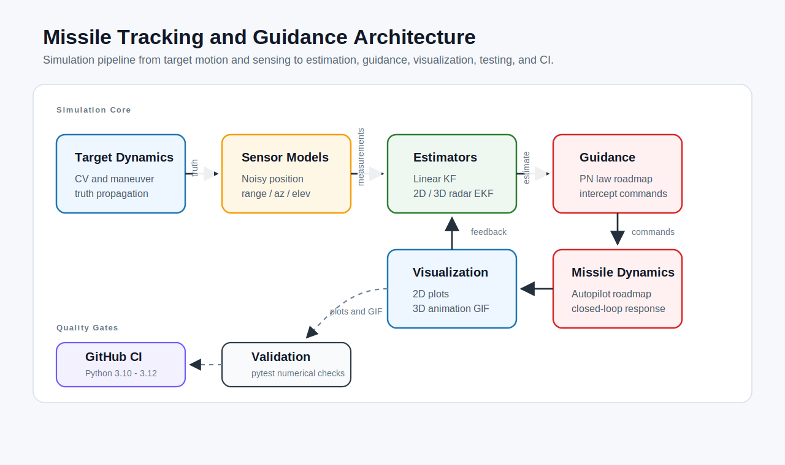

# 3D Target Tracking and GNC Simulation with KF/EKF

[](https://www.python.org/)
[](https://numpy.org/)
[](https://matplotlib.org/)
[](https://github.com/hunkarsuci/missile-tracking-gnc/actions/workflows/tests.yml)
[](LICENSE)
[](#roadmap)

An educational Python project for target tracking, radar measurement modeling, Kalman filtering, Extended Kalman filtering, and Guidance, Navigation, and Control (GNC) simulation concepts.

The current main demo is a **3D radar-EKF tracking simulation**. A target climbs from ground level to 10 km altitude, drops to 8 km, recovers to 9 km, and then continues mostly horizontally while a 3D Extended Kalman Filter estimates its position from noisy radar measurements.

> This repository is for education, research, and portfolio demonstration only. It is not an operational weapon system, real-world guidance implementation, targeting system, or safety-critical control system.

## 3D Demo


The animation shows three signals:

- **Truth**: the simulated target trajectory
- **Radar measurements**: noisy range/azimuth/elevation observations converted to Cartesian coordinates for plotting
- **EKF estimate**: the filter's estimated 3D target position

## System Architecture



## What This Project Demonstrates

This project is organized as a step-by-step estimation pipeline:

1. Simulate target motion.
2. Generate noisy measurements.
3. Estimate position and velocity with Kalman filtering.
4. Add target maneuvers and process-noise tuning.
5. Use nonlinear radar measurements with an EKF.
6. Extend the tracking problem from 2D to 3D.
7. Visualize the result with plots, a 3D animation, tests, and CI.

The early blocks are intentionally simpler 2D examples. They build the mathematical foundation for the final 3D radar-EKF demo.

## Current Capabilities

- 2D constant-velocity target simulation
- Noisy Cartesian position measurements
- Linear Kalman Filter for 2D position/velocity estimation
- Maneuvering target model with acceleration inputs
- Process-noise tuning demonstration
- 2D radar EKF with range-bearing measurements
- 3D radar EKF with range, azimuth, and elevation measurements
- 3D target trajectory with climb, descent, recovery, and horizontal continuation
- GitHub README animation GIF
- System architecture SVG
- Pytest test suite
- GitHub Actions CI tests

## Main 3D Tracking Model

The 3D EKF tracks this state:

```text
x = [px, py, pz, vx, vy, vz]^T
```

where:

- `px, py, pz` are target position components in meters
- `vx, vy, vz` are target velocity components in meters per second

The radar measurement is:

```text
z = [range, azimuth, elevation]^T
```

where:

- `range` is the 3D distance from radar to target
- `azimuth` is the horizontal bearing angle
- `elevation` is the vertical angle above the horizontal plane

The EKF uses a constant-velocity prediction model and nonlinear radar measurement updates. The process-noise tuning allows the filter to respond to the target's climb, drop, re-climb, and curved motion.

## Implemented Blocks

### Block 0 - Target Motion and Noisy Measurements

File: `src/block0_modeling/simulate_cv_target.py`

This block introduces a 2D constant-velocity target:

```text
x = [px, py, vx, vy]^T
```

It generates the ground-truth trajectory and noisy Cartesian position measurements. This is the simplest place to understand the state vector and measurement noise.

### Block 1 - Linear Kalman Filter

Files:

- `src/block1_kf/linear_kf_cv.py`
- `src/block1_kf/run_kf_cv_demo.py`

This block estimates target position and velocity from noisy 2D position measurements:

```text
measurement = [px, py]^T
```

It demonstrates prediction, measurement update, Kalman gain, covariance propagation, Joseph-form covariance update, and RMSE evaluation.

### Block 2 - Maneuvering Target and Process Noise

Files:

- `src/block2_process_noise/simulate_maneuver_target.py`
- `src/block2_process_noise/run_kf_process_noise_demo.py`

This block adds acceleration maneuvers:

```text
x[k+1] = F x[k] + B a[k]
```

It shows why process noise matters. Low process noise gives smoother estimates but reacts slowly to maneuvers. Higher process noise follows maneuvers faster but can look noisier.

### Block 3 - Radar EKF in 2D and 3D

Files:

- `src/block3_ekf/extended_kf_radar.py`
- `src/block3_ekf/simulate_radar_measurements.py`
- `src/block3_ekf/run_ekf_radar_demo.py`
- `src/block3_ekf/extended_kf_radar_3d.py`
- `src/block3_ekf/simulate_radar_measurements_3d.py`

The 2D radar EKF uses:

```text
state       = [px, py, vx, vy]^T
measurement = [range, bearing]^T
```

The 3D radar EKF uses:

```text
state       = [px, py, pz, vx, vy, vz]^T
measurement = [range, azimuth, elevation]^T
```

These files contain the nonlinear radar measurement functions, analytical Jacobians, angle wrapping, prediction step, update step, and radar-to-Cartesian conversion helpers.

### Block 4 - 3D Animation and Scenario Builder

File: `src/block4_visualization/animate_3d_tracking.py`

This is the main public-facing demo. It builds a repeatable 3D scenario:

- Start near `0 km` altitude
- Climb to about `10 km`
- Drop to about `8 km`
- Recover to about `9 km`
- Continue mostly horizontally for about `1 km`
- Track the target with the 3D radar EKF
- Render the result as an interactive Matplotlib animation or GIF

## Quick Start

Create an environment and install dependencies:

```bash
python -m venv .venv
.venv\Scripts\activate
pip install -r requirements.txt
```

Run the test suite:

```bash
pytest -q
```

Run the 2D learning demos:

```bash
python src/block0_modeling/simulate_cv_target.py
python src/block1_kf/run_kf_cv_demo.py
python src/block2_process_noise/run_kf_process_noise_demo.py
python src/block3_ekf/run_ekf_radar_demo.py
```

Run the 3D radar-EKF animation:

```bash
python src/block4_visualization/animate_3d_tracking.py
```

Regenerate the README GIF:

```bash
python src/block4_visualization/animate_3d_tracking.py --save assets/tracking_3d.gif --no-show
```

## Repository Guide

```text
src/
  block0_modeling/
    simulate_cv_target.py             # 2D target truth model and noisy measurements
  block1_kf/
    linear_kf_cv.py                   # Linear Kalman Filter class
    run_kf_cv_demo.py                 # 2D KF demo script
  block2_process_noise/
    simulate_maneuver_target.py       # 2D maneuvering target model
    run_kf_process_noise_demo.py      # Process-noise tuning demo
  block3_ekf/
    extended_kf_radar.py              # 2D radar EKF
    extended_kf_radar_3d.py           # 3D radar EKF
    simulate_radar_measurements.py    # 2D range-bearing radar model
    simulate_radar_measurements_3d.py # 3D range-azimuth-elevation radar model
    run_ekf_radar_demo.py             # 2D radar-EKF demo
  block4_visualization/
    animate_3d_tracking.py            # Main 3D radar-EKF animation
tests/
  test_models.py                      # Motion and measurement-model tests
  test_filters.py                     # KF, EKF, and radar geometry tests
  test_visualization.py               # 3D scenario and animation tests
assets/
  system_architecture.svg             # Architecture diagram shown in README
  tracking_3d.gif                     # 3D animation shown in README
.github/workflows/
  tests.yml                           # GitHub Actions pytest workflow
```

## Testing and CI

The repository includes pytest tests for:

- Target motion propagation
- Measurement generation
- Radar geometry conversions
- 2D EKF measurement functions
- 3D EKF measurement functions and Jacobian shape
- 3D trajectory altitude profile
- EKF tracking accuracy during the final curved section
- Animation smoke testing without opening a display

GitHub Actions runs the tests on Python 3.10, 3.11, and 3.12.

## Technical Concepts

- State-space modeling
- Discrete-time simulation
- Kalman filtering
- Extended Kalman filtering
- Nonlinear radar measurement models
- Analytical Jacobians
- Angle wrapping
- Sensor fusion
- Process-noise tuning
- Maneuvering-target tracking
- 3D trajectory visualization
- RMSE and tracking-error evaluation

## Roadmap

- Proportional Navigation guidance law
- Interceptor point-mass dynamics
- Missile autopilot and actuator effects
- Closed-loop interceptor-target engagement simulation
- Monte Carlo estimator consistency analysis
- UKF or IMM comparison against EKF
- Real-time C++ implementation
- Formatting and linting checks

## License

This project is licensed under the [MIT License](LICENSE).

## Disclaimer

This repository is for educational and portfolio purposes only. It does not provide an operational missile guidance system and must not be used for real-world weapon development, targeting, safety-critical control, or deployment.
